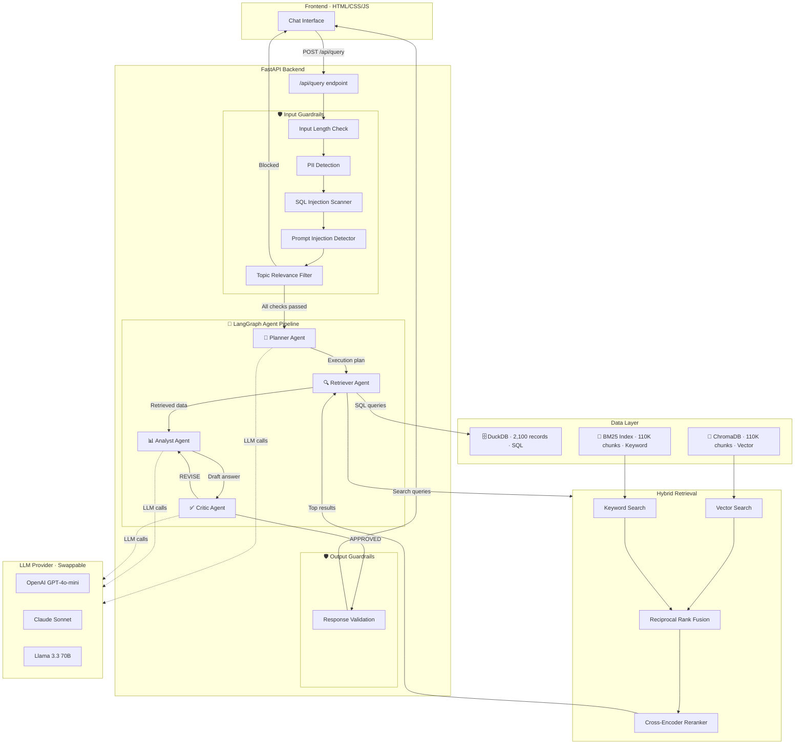

# Financial Intelligence Agent

A production-grade multi-agent AI system for financial Q&A. Combines structured SQL data (2,100 company records) with hybrid semantic search over 110K+ news articles, protected by a layered guardrail system.

Built with LangGraph, FastAPI, ChromaDB, DuckDB, and a custom HTML/CSS/JS frontend.

---

## Architecture Diagram



---

## Guardrails — Safety Mechanisms

The system implements a **layered defense** with 6 guardrails (5 input + 1 output) that run on every query. Blocked queries never reach the LLM — saving cost and preventing abuse.

| # | Guardrail | Layer | What It Catches | Example Trigger |
|---|-----------|-------|----------------|-----------------|
| 1 | **Input Length** | Input | Prompt stuffing, absurdly long inputs | Queries > 2,000 characters |
| 2 | **PII Detection** | Input | SSNs, credit card numbers, emails, phone numbers | `My SSN is 123-45-6789...` |
| 3 | **SQL Injection** | Input | DROP TABLE, UNION SELECT, comment injection, DuckDB escapes | `'; DROP TABLE companies; --` |
| 4 | **Prompt Injection** | Input | Jailbreaks, instruction override, system prompt extraction | `Ignore all previous instructions...` |
| 5 | **Topic Relevance** | Input | Off-topic queries (recipes, medical, legal, creative writing) | `Write me a poem about sunflowers` |
| 6 | **Response Validation** | Output | Leaked system prompts, generic AI refusals in financial context | Catches hijacked LLM behavior |

### How Guardrails Work

1. **Sequential short-circuit**: Input checks run cheapest-first and stop on the first failure — no LLM calls wasted
2. **Visual feedback**: The UI displays guardrail status as colored pills (green ✓ = passed, red ✗ = blocked) on every response
3. **SQL layer protection**: DuckDB queries are additionally restricted to `SELECT`/`WITH`/`EXPLAIN` only — no DDL/DML ever reaches the database
4. **Zero-cost blocking**: Rejected queries return instantly with the guardrail name and a user-friendly explanation

---

## Quick Start

### Prerequisites

- Python 3.10+
- An OpenAI API key (or Anthropic/Groq — see [Swapping LLMs](#swapping-llms))

### 1. Clone & Setup Environment

```bash
git clone <repo-url>
cd financial-intelligence-agent

python3 -m venv venv
source venv/bin/activate   # Windows: venv\Scripts\activate
pip install -r requirements.txt
```

### 2. Configure API Key

```bash
cp .env.example .env
# Edit .env and add your OPENAI_API_KEY
```

### 3. Run Data Ingestion

```bash
python setup.py
```

Downloads ~110K financial news articles from HuggingFace, generates company fundamentals for 105 companies (7 sectors, 20 quarters), and builds all indexes (DuckDB, ChromaDB, BM25). Takes ~15–20 min on first run.

### 4. Start the Application

```bash
# FastAPI (recommended — full-featured UI with guardrails)
uvicorn src.api:app --host 0.0.0.0 --port 8000

# Or Streamlit (simpler alternative)
streamlit run src/ui/app.py
```

Open **http://localhost:8000** in your browser.

---

## Swapping LLMs

Change the provider in `.env` — no code changes needed:

```env
LLM_PROVIDER=anthropic
ANTHROPIC_API_KEY=sk-ant-...
LLM_MODEL=                     # leave blank for defaults
```

| Provider | Default Model | Notes |
|----------|--------------|-------|
| OpenAI | gpt-4o-mini | Best speed/quality/cost balance |
| Anthropic | claude-sonnet-4-20250514 | Higher quality, slower |
| Groq | llama-3.3-70b-versatile | Free tier available |

---

## Project Structure

```
├── frontend/                     # production web UI
│   ├── index.html
│   └── static/
│       ├── style.css             # dark theme, responsive
│       └── app.js                # chat logic, guardrail display
├── src/
│   ├── api.py                    # FastAPI backend + endpoints
│   ├── config.py                 # central config (reads .env)
│   ├── llm.py                    # LLM factory (provider swapping)
│   ├── guardrails.py             # 6-layer safety system
│   ├── logger.py                 # structured logging
│   ├── data_platform/
│   │   ├── ingest.py             # data download + processing
│   │   ├── duckdb_store.py       # SQL database for financials
│   │   ├── chroma_store.py       # vector store for embeddings
│   │   └── bm25_store.py         # BM25 keyword index
│   ├── retrieval/
│   │   └── hybrid.py             # vector + BM25 → RRF → reranking
│   ├── tools/
│   │   └── agent_tools.py        # LangChain tools
│   ├── agents/
│   │   └── graph.py              # multi-agent LangGraph pipeline
│   └── ui/
│       └── app.py                # Streamlit alternative UI
├── evaluation/
│   ├── evaluate.py               # automated eval (LLM-as-judge)
│   ├── test_queries.json         # 20 test queries
│   └── results/                  # evaluation output
├── data/                         # generated by setup.py
├── setup.py                      # one-command data pipeline
├── requirements.txt
├── .env.example
├── ARCHITECTURE.md
└── README.md
```

---

## Data Sources

| Dataset | Source | Records | Purpose |
|---------|--------|---------|---------|
| Financial news | 4 HuggingFace datasets | ~110,000 articles | Semantic search, sentiment, analyst opinions |
| Company fundamentals | Generated (realistic distributions) | 2,100 rows | Revenue, profit, assets, market cap by quarter |

**Structured data**: 105 companies across 7 sectors (Technology, Healthcare, Finance, Energy, Consumer, Industrial, Communication) over 20 quarters (Q1 2020 – Q4 2024).

**Unstructured data**: `ashraq/financial-news-articles`, `oliverwang15/news_with_gpt_instructions`, `twitter-financial-news-sentiment`, `nickmuchi/financial-classification`.

---

## Evaluation Results

20 curated queries tested across SQL lookups, comparisons, aggregations, trend analysis, sentiment, and multi-hop reasoning:

| Metric | Score |
|--------|-------|
| Response Rate | 100% |
| Tool Routing Accuracy | 100% |
| Overall Quality (LLM-as-judge) | **4.74 / 5.0** |
| Relevance | 5.0 / 5.0 |
| Accuracy | 4.6 / 5.0 |
| Completeness | 4.5 / 5.0 |
| Clarity | 4.85 / 5.0 |
| Median Latency | 10.7s |

```bash
python evaluation/evaluate.py
```

---

## Key Design Decisions

- **Hybrid retrieval**: Dense embeddings + BM25 merged via Reciprocal Rank Fusion, re-scored by a cross-encoder. Catches both semantic and exact-match relevance.
- **Multi-agent pipeline**: Planner → Retriever → Analyst → Critic. The Critic catches hallucinations before answers reach the user.
- **Guardrails-first**: Input validation runs before any LLM call. Blocked queries cost zero tokens.
- **Local embeddings**: `all-MiniLM-L6-v2` on CPU — no API key needed for the embedding pipeline.
- **DuckDB**: Embedded SQL, no server required, read-only at runtime for safety.

---

## Live Demo

**[Try it live on HuggingFace Spaces](https://huggingface.co/spaces/Misbah17311/financial-intelligence-agent)**

---

## Demo Video

**[Watch the demo video](https://drive.google.com/file/d/1NOO9nch_FABVqzRPzHIq3KNs-QfEPb8y/view?usp=sharing)**

The demo covers:
1. **Normal flow**: SQL queries, semantic search, complex multi-step analysis
2. **Guardrail activation**: SQL injection, prompt injection, PII detection, off-topic blocking — all caught with visual feedback
